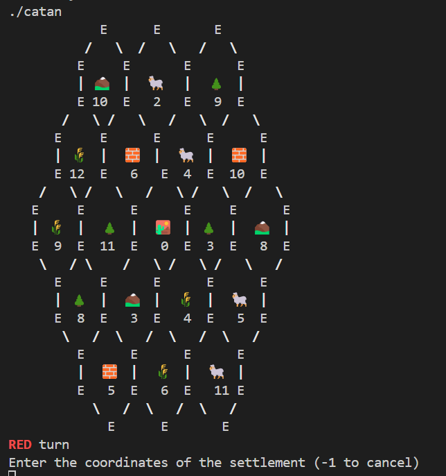
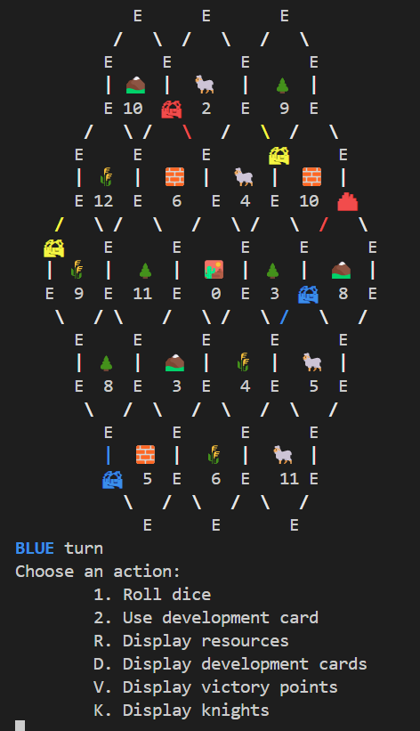

# Catan in the Terminal

This is a simple implementation of the board game Catan in the terminal. It is written in c++.

The game is played by 3 players. The players take turns to build settlements and cities, roads, and buy development cards. The game ends when a player reaches 10 points.

## Images

#### start of the game

#### middle of the game

## Code Hierrachy

### development_cards
This folder contains the code for the development cards. The development cards are: Knight, Victory Point, Road Building, Monopoly, and Year of Plenty.

The development cards are divide into three kinds:
- Knight
- Victory Point
- Promotions cards (Road Building, Monopoly, and Year of Plenty)

In the next diagram, you can see the hierarchy of the development cards, with the main methods.

### game
The game is divided into three main folders:
- player - contains the code for the player.
- game_pieces - contains the code for the game pieces - resources, vertices, edges.
- cards - contains the code for the development cards.

In the next diagram, you can see the hierarchy of the game, with the main methods and attributes, and classes relationships.

