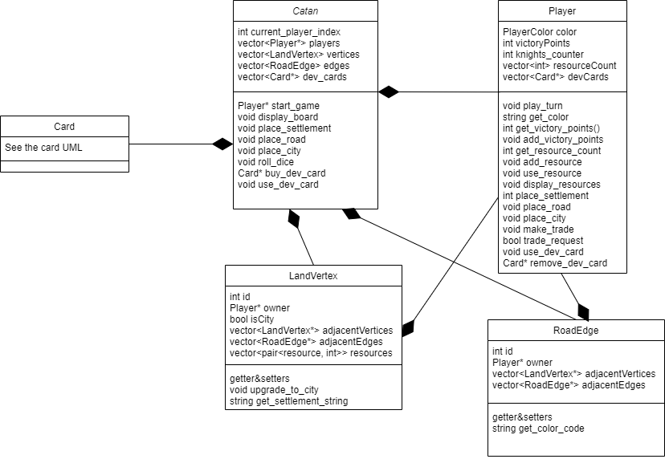

# Catan in the Terminal

This is a simple implementation of the board game Catan in the terminal. It is written in c++.

The game is played by 3 players. The players take turns to build settlements and cities, roads, and buy development cards. The game ends when a player reaches 10 points.

## My game roles
- The game is played by 3 players.
- The game starts in the first round, where each player places 2 settlements and 2 roads - the first player places 1 settlement and 1 road, then the second player places 1 settlement and 1 road, and then the third player places 2 settlements and 2 road, and then the second player places 1 settlement and 1 road, and then the first player places 1 settlement and 1 road. The last settlement that each player places give them the resources of the vertices that the settlement connects to.
- Next, the game starts the normal rounds. Each player plays his turn can roll dice, build settlements, cities, roads, buy development cards, play development cards, and make trades. The player can use the development card before or after the dice roll, but when he uses the card, his turn ends.
- When a player rolls the dice, the game gives resources to the players that have settlements or cities in the vertices that have the number rolled. if the sum of the dices is 7, a player that have more than 7 resources has to discard half of his resources.
- there is 3 type of development cards:
  - Knight -  if a player have 3 knights, he gets 2 victory points (a robber is not part of the game).
  - Victory Point - gives the player 1 victory point (he don't need to use the card to get the point).
  - Promotions cards - there are 3 types of promotions cards:
    - Road Building - the player can build 2 roads. when a player use the card, we ask him to give us 2 coordinates of the edges where he wants to build the roads.
    - Monopoly - the player can take all the resources of a specific type from all the players. when a player uses the card, we ask him to give us the type of the resource that he wants to take, and then we take the resources from all the players.
    - Year of Plenty - the player can take 2 resources of his choice. when a player uses the card, we ask him to give us 2 types of resources that he wants to get, and then we give him the resources.
- player can trade with other players. The player can trade resource cards and development cards. The player can make a trade offer, and then the other players can accept or reject the offer.

## How to run the game
1. Clone the repository.
2. Run the command `make catan` - the game should compile and run in the terminal.

## How to play the game
The game run in the terminal, and for each step a menu will be displayed to the user. The user can choose the action that he wants to do by typing the number or character that is next to the action.

### Vertex and Edge coordinates
The vertices and edges are represented by numbers. The vertices are represented by numbers from 0 to 53, and the edges are represented by numbers from 0 to 71. You can see the coordinates of the vertices and edges in the next images.
| map coordinates| default map coordinates|
|-|-|
|  |  (image is taken from [here](https://colonist.io/dist/images/landing_page_map.png?rev=b263e7f485ddffef4138))|
|||
## Images

|start of the game|middle of the game|
|-----------------|------------------|
|||

## Code Hierrachy

### development_cards
This folder contains the code for the development cards. The development cards are: Knight, Victory Point, Road Building, Monopoly, and Year of Plenty.

The development cards are divide into three kinds:
- Knight (3 total)
- Victory Point (5 total)
- Promotions cards (Road Building, Monopoly, and Year of Plenty - 2 of each)

In the next diagram, you can see the hierarchy of the development cards, with the main methods.

### Game
The game is divided into three main folders:
- player - contains the code for the player.
- game_pieces - contains the code for the game pieces - resources, vertices, edges.
- cards - contains the code for the development cards.

In the next diagram, you can see the hierarchy of the game, with the main methods and attributes, and classes relationships.

## Main methods

### Game

- `void start_game()`: Starts the game. It is the main method that controls the game. it starts the first round, and then the game continues until a player reaches 10 points.
- `void place_settlement(int vertex_id, Player& player, bool first_round = false)` : Places a settlement on the board. It checks it is valid to place to the settlement in a given vertex (if the vertex is empty, and if the player has the resources to build the settlement, if he connects to a road(not in the first round), and if the vertex is not too close to another settlement). If first_round is true, the method does not check if the player connects to a road, and don't take any resources from the player. If the placement is valid, the method takes the resources from the player and give him 1 victory point.
- `void place_city(int vertex_id, Player& player)`: Places a city on the board. It checks if the player has the resources to build the city, and if the vertex is a settlement of the player. If the placement is valid, the method takes the resources from the player and give him 1 victory point.
- `void place_road(int edge_id, Player& player, bool first_round = false)`: Places a road on the board. It checks if the player has the resources to build the road, and if the player connects to a road. If first_round is true, the method don't take any resources from the player. If the placement is valid, the method takes the resources from the player.
- `void roll_dice()`: Rolls the dice. It generates 2 random numbers between 1 and 6, and then it sums them. If the sum is 7, the method calls the method `robber()`, otherwise, it calls the method `give_resources(sum)`.
- `void give_resources(int sum)`: Gives resources to the players. It checks the vertices that have the number rolled, and then it gives the resources to the players that have settlements or cities in the vertices.
- `void robber()`: Each player with more than 7 resources has to discard half of his resources.
- `void buy_dev_card(Player& player)`: Buys a development card. It checks if the player has the resources to buy the card, and then it gives him a random development card. If the card is a knight, the knight_counter of the player is incremented. If the card is a victory point, the player receives 1 victory point.
- `void play_dev_card(Player& player, Card* card)`: Plays a development card. It checks if the card is a Promotions card, and then it calls the method `use` of the card.
- `void make_trade_offer(Player& trader, const vector<pair<resource, int>>& offer_res, const vector<Card*>& offer_dev, const vector<pair<resource, int>>& request_res, const vector<pair<CardType, int>>& request_dev)` - Makes a trade offer. Get a trade offer from a player, and then it calls the method `trade_request` of the other players. If the other player accepts the trade, the method preforms the trade (and validates that the trade is valid).

### Player
the player methods are divided into two main categories:
1. methods that get an input from the terminal.
2. methods that are independent of the input source, and get the input from the method calls.

#### Methods that get an input from the terminal
- `void play_turn(Catan& game)`: Plays the turn of the player. It gets the input from the terminal, and then it calls the methods of the game/other player methods.
- `int place_settlement(Catan& game, bool first_round = false)`: Ask the user a coordinate to place a settlement. the method ask the user until the user gives a valid coordinate or asks to cancel the action. The return value is the vertex_id of the vertex where the player wants to place the settlement.
- `void place_city(Catan& game)`: Ask the user a coordinate to place a city. the method ask the user until the user gives a valid coordinate or asks to cancel the action.
- `int place_road(Catan& game, bool first_round = false)`: Ask the user a coordinate to place a road. the method ask the user until the user gives a valid coordinate or asks to cancel the action. The return value is the edge_id of the edge where the player wants to place the road.
- `void make_trade(Catan& game)`: Take the user input to make a trade - the resource cards and development cards that the player wants to trade, and the resource cards and development cards that the player wants to receive. In the end of the input, the method calls the `make_trade_offer` of the `Catan` class.
- `bool trade_request(Player &trader, const vector<pair<resource, int>> &offer_res, const vector<Card *> &offer_dev, const vector<pair<resource, int>> &request_res, const vector<pair<CardType, int>> &request_dev)`: Ask the user if he wants to accept the trade offer. The method returns true if the player accepts the trade, and false otherwise.
- `void play_dev_card(Catan& game)`: Ask the user which development card he wants to play. The method ask the user until the user gives a valid card or asks to cancel the action. In the end it calls the method `play_dev_card(game, card)` of the `Player` class ( the method that is independent of the input source).
- `void robber()`: If the user has more than 7 resources on 7 roll, the method asks the user to discard half of his resources.

#### Methods that are independent of the input source
- getters and setters
- `string get_color_code()`: Returns the color code of the player so we can print the in the color of the player to the terminal.
- `void add_resource(resource res, int amount)`: Adds `amount` of `res` to the player.
- `void display_resources()`: Displays the resources of the player with emojis.
- `void display_dev_cards()`: Displays the development cards of the player with emojis.
- `void buy_dev_card(Catan& game)`: Buys a random development card
- `void play_dev_card(Catan& game, Card* card)`: Plays a development card. If the card is a Promotions card, the method will remove the card from the player's hand.
- `Card* get_dev_card(CardType type)`: Returns a development card of the type `type` from the player's hand. If the player does not have a card of the type `type`, the method returns nullptr.
- `Card* remove_dev_card(Card* card)`: Removes the card `card` from the player's hand. The method returns the card that was removed. 

## More make commands
- `make test` - runs the tests of the game.
- `make clean` - cleans the object files and the executable file.
- `make valgrind` - runs the valgrind tool on the executable file.
- `make tidy` - runs the clang-tidy tool on the code.
- `make debug` - run the code with gdb debugger.